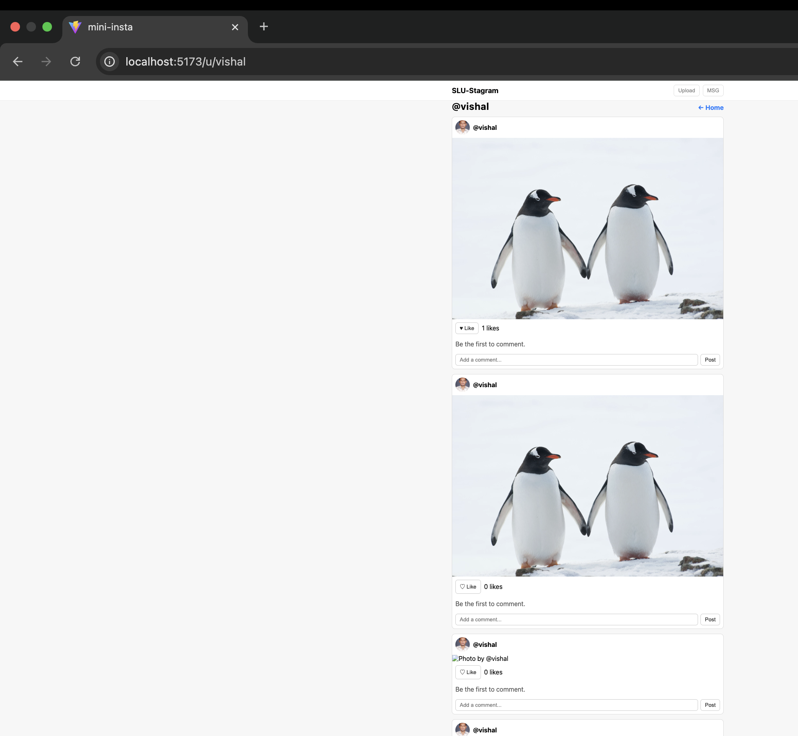

SLU-Stagram — Lab 2 (React Mini Insta)

React mini social feed with accessible design, persistent posts and localStorage.  
Implemented keyboard submission, hover effects and meaningful alt text.

Screenshots:
--
System Font & Centered Layout
Uses `font-family: system-ui` and centered container (≤720px).

--
Hover Effect
Buttons visibly change background/border color on hover.

--
Keyboard Accessibility
**Enter key** in Composer submits new post (adds immediately to feed).  

**Like button** uses `aria-pressed={post.likedByMe}`.

---
Meaningful Alt Attributes
Avatar : `alt="vishal avatar"`  
Post photo : `alt="Photo by @vishal"`
  

---

Console Clean: 
App runs without errors or warnings in the console.

---

Routing Verification:
Profile pages render posts filtered by author (`/u/:handle`).

---

Feed with Two Posts:
Feed shows two posts — one liked and one unliked.

---

Comment Added:
Shows a post with a visible comment displayed under it.

---

Features Implemented:

Create posts with image URL & caption  
Like / Unlike with live counter  
Comment under each post  
Keyboard accessibility (Enter to post)  
Meaningful alt text for all images  
Persistent data via localStorage  
Responsive centered layout  
Hover effects for buttons  

--

Components Overview:

App.jsx:        Holds the main `posts` state and controls persistence using `localStorage`. Passes data to child components as props. 
Composer.jsx:   Handles the creation of new posts. Submits when pressing Enter or clicking “Share”. 
Feed.jsx:       Displays a list of all posts. 
PostCard.jsx :  Renders a single post with avatar, image, like/unlike button and comments section. 
CommentForm.jsx & CommentList.jsx: Manage adding and displaying comments under each post. 
Profile.jsx:    Filters posts by author when visiting `/u/:handle`. 
Navbar.jsx:     Shows the title and navigation buttons (Upload / MSG). 

---

State Location: 
All posts are stored in `App.jsx` under the `posts` state variable.  
They are passed down via props to other components.  
Posts persist automatically in browser `localStorage`.

----

Technologies Used:
React + Vite  
React Router  
JavaScript ES6  
LocalStorage API  
CSS (system font, hover, responsive)
--